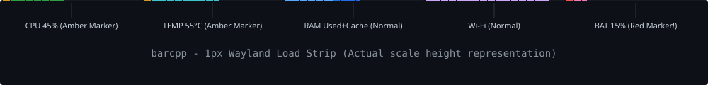

# barcpp - минималистичный мониторинг системы для Hyprland



Без GTK, Qt, Cairo и вообще без тулкита. Только `libwayland-client` +
протокол `wlr-layer-shell` напрямую, пиксели пишутся в shared-memory буфер
руками. Никаких форкнутых процессов (`free`, `awk`, `cat` и т.п.) - все
метрики читаются прямым чтением `/proc` и `/sys`.

Пять равных сегментов полоски (в зависимости от конфига). Внутри каждого
заливка слева направо, остаток — тёмный фон:

- **CPU** — % загрузки
- **TEMP** — % нагрева относительно максимума
- **RAM** — стек: Used + Cache (Available−Free); free = фон
- **WIFI** — мощность сигнала
- **BAT** — остаток %

Цвета и высота — в `barcpp.conf` рядом с бинарником.

## Сборка (Arch Linux)

```bash
sudo pacman -S --needed base-devel wayland wayland-protocols pkgconf
make
```

Makefile сам:
- прогоняет `wayland-scanner` по вложенному `wlr-layer-shell-unstable-v1.xml`
  и по `xdg-shell.xml` из системного пакета `wayland-protocols` (нужен,
  потому что сгенерированный код layer-shell ссылается на
  `xdg_popup_interface`, даже если попапы не используются);
- патчит известный баг: в сгенерированном заголовке параметр называется
  `namespace`, а это зарезервированное слово в C++ — g++ иначе не соберёт.

Добавить в `~/.config/hypr/hyprland.conf`:

```
exec-once = /path/to/barcpp
```

Полоска: анкорится к верху экрана, тянется на всю ширину, `exclusive_zone`
= `height` из конфига.

## Настройка — `barcpp.conf`

Файл ищется так (первый найденный):
1. `$BARCPP_CONFIG`
2. `barcpp.conf` рядом с бинарником (рекомендуется)
3. `~/.config/barcpp/config`

```
height = 2
gap_px = 2
poll_ms = 1000
color_bg = #1a1a1a
color_cpu = #3ddc84
color_ram_free = #4d88ff
color_ram_avail = #2a4a88
color_bat = #7d4dff
...
```

## Как читать полоску

```
|████░░░░░|██████░░░|██░░░░████|██████████|████████░░|   ← height px
 CPU 45%   TEMP 55C  Used+Cache  WIFI 100%  BAT 80%
```

- **CPU** — длина = load %, цвет green→amber→red (первые 5% зеленый маркер)
- **TEMP** — длина = температура (относительно temp_max_c), цвет cyan→amber→red (первые 5% бирюзовый маркер)
- **RAM** — длина = Used %, цвет green→amber→red (первые 5% синий маркер); сразу за ним дорисовывается тёмно-синий кэш. Остаток — пустой фон (Free).
- **WIFI** — длина = RSSI (0..100%), фиолетовый маркер 5%, зелёный (если сигнал ок) или красный/жёлтый при низком.
- **BAT** — длина = remaining %; розовый маркер 5%, зелёный, красный если < `bat_low_pct`

## О ресурсах

- Бинарник ~33KB, слинкован только с `libwayland-client` (+ транзитивно
  `libffi`, `libc`). Никакого GTK/Qt/Cairo в адресном пространстве.
- В простое — 0% CPU: единственный системный вызов в холостом цикле —
  `poll()` с таймаутом 1с, никакого busy-loop.
- На каждую отрисовку — чтение трёх маленьких файлов + запись ~3 000
  пикселей (для полноэкранной ширины ~1920px × 2 строки) в уже
  замапленную память. Микросекунды, не миллисекунды.
- RSS обычно 1–3MB (почти всё — сам shm-буфер и статика wayland-client).

Для сравнения, если тот же функционал держать через eww — это плюс весь
GTK/Pango/Cairo рантайм в памяти (обычно от 20 до 40+MB RSS на процесс)
и обвязка из bash-скриптов, которые каждую итерацию форкают
`free`/`awk`/`cat` — тоже мелочь по CPU, но не ноль, и точно не такой
компактный набор зависимостей.

## Известные ограничения / что можно доделать

- `output = nullptr` при создании layer-surface — компоситор сам решает,
  на каком мониторе показать полоску (обычно текущий фокусный). Для
  явного выбора монитора нужно забиндить `wl_output` через registry и
  передать его вместо `nullptr`.
