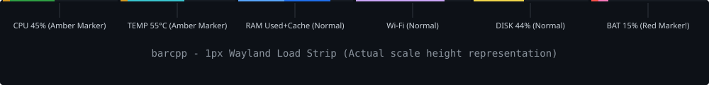

# barcpp - минималистичный мониторинг системы для Hyprland



Без GTK, Qt, Cairo и вообще без тулкита. Только `libwayland-client` +
протокол `wlr-layer-shell` напрямую, пиксели пишутся в shared-memory буфер
руками. Никаких форкнутых процессов (`free`, `awk`, `cat` и т.п.) - все метрики
читаются напрямую: CPU/RAM/SWAP/PSI — из `/proc`, TEMP/BAT — из `/sys`, WIFI — через
`netlink` (nl80211), DISK — системным вызовом `statvfs`.

Равные сегменты полоски (в зависимости от конфига и наличия датчиков). Внутри каждого
заливка слева направо, остаток — тёмный фон:

- **CPU** — % загрузки
- **TEMP** — % нагрева относительно максимума
- **RAM** — стек: Used + Cache (Available−Free); free = фон
- **SWAP** — заполненность swap; виден, только если swap есть
- **WIFI** — мощность сигнала
- **DISK** — заполненность системного диска
- **BAT** — остаток %

Цвета и высота — в `barcpp.conf` рядом с бинарником.

## Сборка (Arch Linux)

```bash
sudo pacman -S --needed base-devel wayland wayland-protocols pkgconf
make
```

Makefile сам:
- прогоняет `wayland-scanner` по вложенному `wlr-layer-shell-unstable-v1.xml`
  и по `xdg-shell.xml` из системного пакета `wayland-protocols` (нужен,
  потому что сгенерированный код layer-shell ссылается на
  `xdg_popup_interface`, даже если попапы не используются);
- патчит известный баг: в сгенерированном заголовке параметр называется
  `namespace`, а это зарезервированное слово в C++ — g++ иначе не соберёт.

Тесты логики порогов (без Wayland): `make test`.

Добавить в `~/.config/hypr/hyprland.conf`:

```
exec-once = /path/to/barcpp
```

Полоска: анкорится к верху экрана, тянется на всю ширину, `exclusive_zone`
= `push_windows_px` из конфига.

## Настройка — `barcpp.conf`

Изменения применяются без перезапуска: `pkill -HUP barcpp`.

Файл ищется так (первый найденный):
1. `$BARCPP_CONFIG`
2. `barcpp.conf` рядом с бинарником (рекомендуется)
3. `~/.config/barcpp/config`

```
height = 2
gap_px = 2
poll_ms = 1000
color_bg = #1a1a1a
color_cpu = #3ddc84
color_ram_free = #4d88ff
color_ram_avail = #2a4a88
color_bat = #7d4dff
...
```

## Как читать полоску

```
|████░░░░░░|█████░░░░░|████████░░|██░░░░░░░░|██████████|████░░░░░░|████████░░|   ← height px
 CPU 45%    TEMP 55C   Used+Cache  SWAP 20%   WIFI 100%   DISK 44%    BAT 80%
```

Сегменты идут слева направо в таком порядке: CPU, TEMP, RAM, SWAP, WIFI, DISK, BAT.
Сегмент, для которого нет датчика или данных (нет swap, нет температуры, нет Wi-Fi),
пропускается, и остальные занимают его место. Первые `marker_px` пикселей каждого
сегмента — маркер состояния: он окрашивается в жёлтый или красный и мигает, когда
значение выходит за пороги. Остальное — заливка по значению.

PSI не имеет своего сегмента: он влияет на маркеры RAM и SWAP и на оранжевую полоску
поверх заливки SWAP (см. раздел про PSI ниже).

- **CPU** — длина = load %, цвет green→amber→red (маркер — первые `marker_px` пикселей, зелёный)
- **TEMP** — длина = температура (относительно temp_max_c), цвет cyan→amber→red (маркер бирюзовый)
- **RAM** — длина = Used %, цвет blue→amber→red (маркер синий); сразу за ним дорисовывается тёмно-синий кэш. Остаток — пустой фон (Free). Маркер также поднимается по давлению памяти (PSI), если оно выше порогов.
- **SWAP** — длина = занятый swap %, фиолетовый, жёлтый/красный по `swap_mid_pct` / `swap_high_pct`. Маркер также поднимается по PSI. Поверх заливки накладывается оранжевая полоска PSI (`color_psi`): 0..`psi_high_pct` даёт 0..100% сегмента, выше обрезается. Что длиннее — то и сильнее: если оранжевая часть дальше фиолетовой, давление памяти важнее занятости swap. Выключается `psi_overlay = 0`.
- **WIFI** — длина = RSSI (0..100%, линейно по dBm: −50 dBm = 100%, −90 dBm = 0%), фиолетовый сегмент; маркер становится жёлтым ниже `wifi_mid_dbm` (по умолчанию −70 dBm), красным ниже `wifi_low_dbm` (−80 dBm).
- **DISK** — индикатор заполненности диска, жёлтый от `disk_mid_pct`, красный от `disk_high_pct`.
- **BAT** — длина = remaining %; розовый (`color_bat`) в обычном режиме, включая работу от батареи; серый (`color_bat_idle`), если блок питания подключён и батарея не заряжается (`Not charging` / `Full`). Маркер жёлтый ниже `bat_mid_pct` (30%), красный ниже `bat_low_pct` (10%). При зарядке маркер медленно мигает зелёным (`color_bat_charging`), предупреждения не показываются.

## Давление памяти (PSI)

PSI (Pressure Stall Information) показывает не объём занятой памяти, а то, сколько
времени задачи простаивают из-за её нехватки. Читается `/proc/pressure/memory`,
используется значение `some avg10` — процент времени за последние 10 секунд, когда
хотя бы одна задача ждала память (своп, очистка кэша, подкачка страниц).

- Пороги: жёлтый от `psi_mid_pct` (5%), красный от `psi_high_pct` (20%).
- Маркер RAM и маркер SWAP поднимаются по максимуму из своей занятости и PSI.
- На сегменте SWAP поверх заливки рисуется оранжевая полоска PSI (`color_psi`).
  Шкала: 0..`psi_high_pct` соответствует 0..100% сегмента, выше обрезается.
- Ключи: `enable_psi`, `psi_overlay`, `psi_mid_pct`, `psi_high_pct`, `interval_psi_ms`,
  `color_psi`. Если `/proc/pressure/memory` нет (старое ядро), PSI отключается с
  предупреждением в stderr.

## Мигание маркера

Когда сегмент уходит в **warning** (жёлтый) или **critical** (красный), его маркер
начинает мигать, исчезая в фон (`color_bg`):

- **Warning** — медленно: фаза меняется раз в `poll_ms` (полный период = 2 × `poll_ms`,
  по умолчанию 4 с), **без** дополнительных перерисовок (0 доп. CPU).
- **Critical** — быстро (`blink_crit_period_ms`, по умолчанию 300 мс ~3.3 Гц);
  пока хоть один сегмент критичен, цикл отрисовки временно ускоряется до
  `blink_fast_poll_ms` (по умолчанию 150 мс). Чтение метрик при этом остаётся
  строго по своим интервалам — тратится только доп. перерисовка, и только пока есть
  критическое состояние.
- **Зарядка (BAT)** — маркер медленно мигает зелёным (`color_bat_charging`) в том же
  ритме, что warning. Пороги батареи при зарядке не применяются: ни жёлтого, ни красного,
  ни быстрого мигания.

Отключается `enable_blink = 0` (тогда маркер зарядки горит ровно зелёным). Полные
параметры — в `barcpp.conf`.

## О ресурсах

- Бинарник ~60KB, слинкован с `libwayland-client`, `libnl` (для Wi-Fi) и
  `libm` (+ транзитивно `libffi`, `libc`). Никакого GTK/Qt/Cairo в адресном
  пространстве.
- В простое — 0% CPU: единственный системный вызов в холостом цикле —
  `poll()` с таймаутом `poll_ms` (по умолчанию 2 с). Во время критического
  мигания цикл кратковременно ускоряется до `blink_fast_poll_ms`, но только
  пока есть критическое состояние.
- На каждую отрисовку — запись ~ширина_экрана × `height` пикселей (для
  ~1920px при height=2 это ~3 800) в уже замапленную память. Метрики
  читаются строго по своим интервалам. Микросекунды, не миллисекунды.
- Кадр отправляется компоситору только если пиксели изменились (хеш сравнивается
  с предыдущим кадром), поэтому статичная полоска не нагружает композитор.
- RSS обычно 1–3MB (почти всё — сам shm-буфер и статика wayland-client).

Для сравнения, если тот же функционал держать через eww — это плюс весь
GTK/Pango/Cairo рантайм в памяти (обычно от 20 до 40+MB RSS на процесс)
и обвязка из bash-скриптов, которые каждую итерацию форкают
`free`/`awk`/`cat` — тоже мелочь по CPU, но не ноль, и точно не такой
компактный набор зависимостей.

## Известные ограничения / что можно доделать

- `output = nullptr` при создании layer-surface — компоситор сам решает,
  на каком мониторе показать полоску (обычно текущий фокусный). Для
  явного выбора монитора нужно забиндить `wl_output` через registry и
  передать его вместо `nullptr`.
- `temp_path` и путь к датчику батареи определяются один раз; при `pkill -HUP`
  новый датчик температуры не подхватывается, нужен перезапуск.
- PSI используется только `some avg10`; значение `full` (полная остановка системы)
  не показывается.
- Полоска PSI рисуется поверх заливки SWAP во всей высоте полоски, отдельной строки
  для PSI пока нет.
